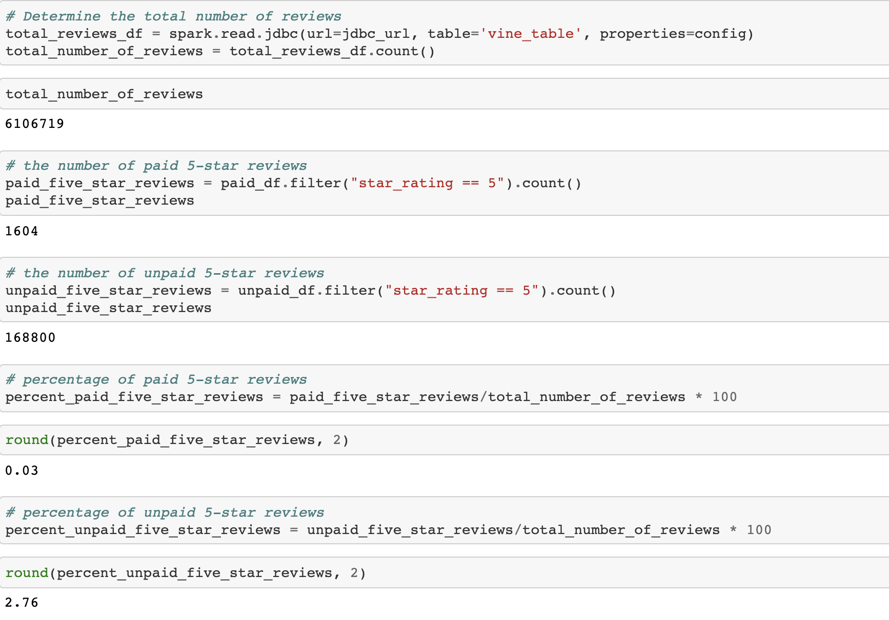

# Amazon Vine Analysis Challenge
# Amazon Vine Analysis

## Overview of the Analysis

In this Amazon_Vine_Analysis, the primary goal of the project was analyzing Amazon reviews written by members of the paid Amazon Vine program. With the use of PySpark, Pandas, or SQL we were tasked with determining if there was any bias toward favorable reviews from Vine members. 

## Results

How many Vine reviews and non-Vine reviews were there?

There were was a total of:

* 6,106,719 reviews

How many Vine reviews were 5 stars and How many non-Vine reviews were 5 stars?

Of these reviews, there was a total of:

* 170,404 reviews (here, we added unpaid reviews which were 168,800 and paid reviews of 1,604 to conclude this number...reference image below)

What percentage of Vine reviews were 5 stars? What percentage of non-Vine reviews were 5 stars?

* 0.03% were Vine reviews and 2.76% were non-Vine reviews.

## Summary

In conclusion, based on our data we can infer that there was nearly no bias between those reviews that were a part of the Amazon Vine program and those that were not. Nevertheless, in order to improve the accuracy of our analysis we could try checking the verification of these reviews to cross-reference and check that those reviews provided in our analysis were legitimate and genuine. 
